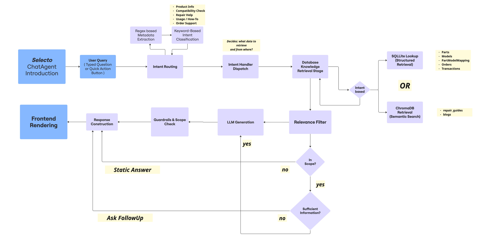

# Selecto: PartSelect Chat Agent - Case Study (for InstaLily)

PartSelect Chat Agent is an intelligent conversational system designed to assist users with appliance parts selection, compatibility verification, and repair guidance. The agent combines advanced RAG (Retrieval-Augmented Generation) technology with SQL database integration to provide accurate, context-aware responses for refrigerator and dishwasher maintenance and repair queries.

## Key Features

🔍 **Smart Parts Identification**: Instantly find parts by ID, get pricing, installation difficulty, and replacement suggestions

🛠️ **Step-by-Step Repair Guidance**: Get troubleshooting help with context-aware repair instructions from comprehensive repair guides

✅ **Compatibility Verification**: Verify if parts fit your specific appliance model with database-backed compatibility checks

📦 **Order Tracking & Support**: Check order status, shipping details, and handle returns seamlessly

📚 **Usage Guides & How-To**: Access blog articles and guides for appliance features, settings, and usage tips

🤖 **Context-Aware Conversations**: Intelligent intent routing ensures accurate responses tailored to your specific query type


## 🏗️ System Architecture

The following diagram illustrates the complete request flow from user query to response, including intent routing, data retrieval, and response generation:



*Note: If the image doesn't display, you can find it in the `docs/` directory or view it in the repository.*

### Key Components

- **Frontend**: React-based chat interface with PartSelect branding
- **Backend**: FastAPI with modular, extensible architecture
- **LLM**: DeepSeek integration (OpenAI-compatible API)
- **Database**: SQLite for structured data (parts, models, orders)
- **Vector DB**: ChromaDB for semantic search (repairs, blogs)

## 📊 Data Sources & Architecture

### Current Implementation (Demo)
- **Parts Data**: Web-scraped using Selenium scrapers (`backend/scrappers/`)
- **Repair Guides & Blogs**: Web-scraped and stored in `data/` directory
- **Orders**: Dummy data seeded via `scripts/seed_orders.py` for testing

### Production-Ready API Integration
The system is architected to seamlessly transition to real PartSelect APIs:
- **API Client**: `app/data/api_client.py` provides `PartSelectAPIClient` class
- **Ready Methods**: `fetch_part_records()`, `fetch_crossref_records()`, `fetch_blog_documents()`, `fetch_repair_guides()`
- **Zero Code Changes**: The ingestion pipeline (`scripts/ingest_from_api.py`) works identically with API or scraped data
- **Simple Swap**: When PartSelect APIs are available, update `PartSelectAPIClient` to make HTTP calls instead of reading local files

This design ensures the system works immediately with scraped data while being production-ready for API integration.

## ✨ Technical Highlights

- **Intent-Based Routing**: Fast, deterministic routing using keyword + regex (no LLM calls for routing)
- **RAG Implementation**: Dual collections (repairs + blogs) with MMR ranking for diverse, relevant results
- **Hybrid Architecture**: Rules-based routing + LLM for natural responses (best of both worlds)
- **Rich Metadata Responses**: Structured data (product cards, order cards) alongside text for better UX
- **Comprehensive Testing**: 79+ unit tests + integration tests for reliability
- **Modular Design**: Easy to extend with new intents, handlers, and RAG collections

## 🚀 Quick Start

### Prerequisites
- Python 3.9+
- Node.js 18+
- DeepSeek API key (required)

### Setup

1. **Clone the repository**
   ```bash
   git clone https://github.com/shreyajena/partselect-agent.git
   cd PartSelect-Agent
   ```

2. **Backend Setup**
   ```bash
   cd backend
   python3 -m venv .venv
   source .venv/bin/activate  # On Windows: .venv\Scripts\activate
   pip install -r requirements.txt
   
   # Set up environment variables
   cp .env.example .env
   # Edit .env and add: INSTALILY_DEEPSEEK_API_KEY=your_key_here
   
   # Ingest Web-Scraped CSV data
   python -m scripts.ingest_parts
   python -m scripts.ingest_docs
   
   # Start server
   uvicorn app.main:app --reload
   ```

3. **Frontend Setup**
   ```bash
   cd frontend
   npm install
   npm run dev
   ```

4. **Access the application**
   - Frontend: http://localhost:5173
   - Backend API: http://localhost:8000
   - API Docs: http://localhost:8000/docs

## 📁 Project Structure

```
PartSelect-Agent/
├── backend/                 # FastAPI backend
│   ├── app/
│   │   ├── agent/          # Business logic handlers
│   │   ├── router/        # Intent routing + extraction
│   │   ├── config/        # Constants, prompts, URLs
│   │   ├── llm/           # DeepSeek/OpenAI clients
│   │   ├── rag/           # Vector DB + retrieval
│   │   └── models.py      # Database schema
│   ├── data/              # Seed data (CSV, JSON)
│   ├── scripts/           # Data ingestion scripts
│   ├── tests/             # Unit + integration tests
│   └── requirements.txt
│
├── frontend/               # React frontend
│   ├── src/
│   │   ├── components/
│   │   │   └── chat/      # Chat widget components
│   │   ├── api/          # API client
│   │   └── pages/        # Demo pages
│   └── package.json
│
└── README.md              # This file
```

## 🧪 Testing

### Backend Tests
```bash
cd backend
pytest                    # Run all tests
pytest tests/unit/        # Unit tests only
pytest tests/integration/ # Integration tests
pytest --cov=app          # With coverage
python test_api_queries.py # API endpoint testing
```

### Frontend Tests
```bash
cd frontend
npm run lint              # Lint check
npm run build            # Build check
```

## 📚 Documentation

- [Backend README](backend/README.md) - Detailed backend documentation
- [Frontend README](frontend/README.md) - Frontend setup and architecture
- [API Documentation](http://localhost:8000/docs) - Interactive API docs (when server running)

## Design Decisions

### Architecture
- **Modular Design**: Clear separation of concerns (router, handlers, queries, utils)
- **Intent-Based Routing**: Keyword + regex for fast, deterministic routing
- **Hybrid Approach**: Rules-based routing + LLM for natural responses
- **RAG for Context**: Vector search for repair/blog content, SQL for structured data

### Frontend
- **Component-Based**: Reusable React components
- **Brand Consistency**: PartSelect colors and design system
- **Rich Metadata**: Product cards, order cards, interactive buttons
- **Progressive Enhancement**: Works without JavaScript for basic functionality

### Extensibility
- **Easy Intent Addition**: Add to `Intent` enum, create handler, update router
- **Configurable LLM**: Switch between DeepSeek and OpenAI
- **Pluggable Collections**: Add new RAG collections easily
- **Test Coverage**: Comprehensive tests for reliability

## 🏛️ Key Architecture Decisions

### Intent-Based Routing (Not LLM-Based)
**Why**: Fast (sub-millisecond), cost-effective (zero routing cost), and deterministic. Uses keyword + regex matching instead of LLM calls for intent classification.

### Hybrid Approach: Rules + LLM
**Why**: Combines fast, deterministic routing with natural language responses. Rules ensure accuracy, LLM provides context-aware answers.

### Rich Metadata Responses
**Why**: Structured metadata (product cards, order cards) alongside text improves UX and reduces LLM verbosity. Frontend renders interactive components.

### RAG with Dual Collections
**Why**: Separate collections (repairs/blogs) with MMR ranking ensures diverse, relevant results. Source bias prioritizes preferred collection.

**For detailed architecture decisions, see [Backend README](backend/README.md#architecture-decisions).**

## 🔒 Environment Variables

### Backend (.env)
```bash
INSTALILY_DEEPSEEK_API_KEY=your_key_here
INSTALILY_LLM_PROVIDER=deepseek  # or "openai"
INSTALILY_DEEPSEEK_MODEL=deepseek-chat
INSTALILY_LOG_LEVEL=INFO
```

### Frontend (.env.local)
```bash
VITE_API_BASE_URL=http://localhost:8000
```

## 📊 Example Queries

The system handles queries across 8 distinct intents. Here are three examples:

1. **"How can I install part number PS11752778?"**
   - Returns: Part details, pricing, installation difficulty, and step-by-step guidance with interactive product card

2. **"Is PS11752778 compatible with my WDT780SAEM1 model?"**
   - Returns: Database-verified compatibility result with clear yes/no answer

3. **"The ice maker on my Whirlpool fridge is not working. How can I fix it?"**
   - Returns: Context-aware repair guidance from RAG-retrieved repair guides with links to repair resources

## Contributing

This is a case study project. For questions or improvements:
1. Review the code structure
2. Check test coverage
3. Follow existing patterns
4. Add tests for new features

## License

This project is a case study submission for Instalily.

## Acknowledgments

- PartSelect for the use case and branding
- DeepSeek for LLM capabilities
- ChromaDB for vector storage

